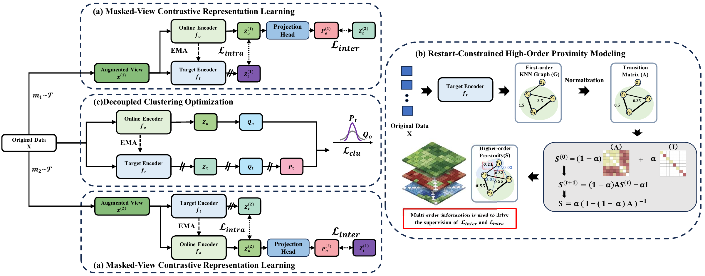

# DC<sup>2</sup>R<sup>2</sup>

PyTorch implementation for **Decoupled Contrastive Clustering with Restart Random Walk**.



Source code and datasets: [https://github.com/Soiior/DC2R2](https://github.com/Soiior/DC2R2)

## Requirements

- PyTorch
- NumPy
- SciPy
- scikit-learn
- PyYAML
- torchinfo

Install PyTorch for your compute device using the [official instructions](https://pytorch.org/get-started/locally/), then install the remaining packages:

```bash
pip install numpy scipy scikit-learn PyYAML torchinfo
```

## Datasets

Place the dataset files in `data/`. Each MATLAB file should contain a feature matrix `X` and a label vector `Y`.

The current release includes the processed MATLAB files and configurations for
**AgNews**, **Biomedical**, **SearchSnippets**, and **StackOverflow**. Each
supplied configuration expects 768-dimensional input features.

## Training

```bash
git clone https://github.com/Soiior/DC2R2.git
cd DC2R2
```

Run from the repository root. Hyperparameters and training options are defined in the YAML configuration files; YAML values take precedence over matching command-line arguments.

```bash
python main_train.py --config_file config/AgNews.yaml
python main_train.py --config_file config/Biomedical.yaml
python main_train.py --config_file config/SearchSnippets.yaml
python main_train.py --config_file config/StackOverflow.yaml
```

Logs and the best checkpoint are saved under the configured `output_dir`.

Evaluation uses K-means on target-encoder representations. The best evaluated
epoch is selected by ACC.

## Reference

If you use this work, please cite the manuscript:

> Hang Guo, Haitao Nie, Jinyang Zhai, Zihua Zhao, Rong Wang, and Feiping Nie. **Decoupled Contrastive Clustering with Restart Random Walk**. Manuscript.

The paper link and final BibTeX entry will be added when available.
